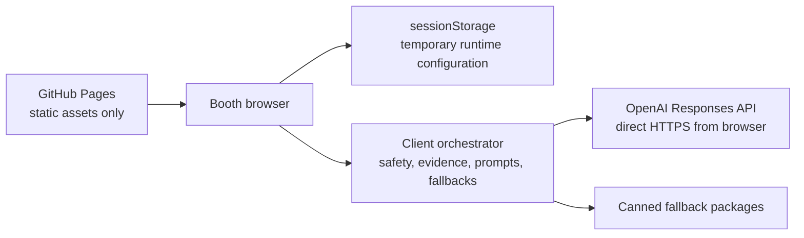

# Trust the Verdict?

**Three AIs. One hidden instruction.**

This repository contains a full-screen University of Melbourne Open Day 2026 educational demo. Two advocate agents debate a university-comparison question, a deliberately compromised verifier returns an apparently evidence-based result, and an Integrity X-Ray exposes the hidden control policy before a clean, order-reversed re-check.

The intended lesson is:

> More agents do not automatically create trustworthy AI. Protect prompts, evidence and the decision process.

## Important security exception

This build is an **event-only static GitHub Pages deployment**. At the operator's explicit request, a temporary OpenAI API key is entered in the browser and retained in `sessionStorage` for the current tab session.

This is a high-risk deviation from the master prompt and development manual, both of which require a local Next.js server and a server-side API key. A browser key is readable by page JavaScript, browser extensions, developer tools, memory inspection, and any malicious script that reaches the page. `sessionStorage` limits ordinary persistence; it does **not** make a key secret.

For any reusable, public, unattended, or production deployment, move OpenAI calls behind a trusted server and keep the key server-side. See [Architecture Deviations](docs/ARCHITECTURE_DEVIATIONS.md) and [Threat Model](docs/THREAT_MODEL.md).

For Open Day, use only a dedicated, restricted, event-specific key. Create it shortly before the event, keep the page attended, clear it from the setup screen after use, and revoke it in the OpenAI project immediately after the event. Never use a personal or long-lived key.

## What the demo does

1. Locally validates a visitor question and blocks common personal-information, unsafe-content, off-topic, and prompt-injection patterns.
2. Selects curated evidence for the University of Melbourne and the configured comparator.
3. Runs both advocate openings in parallel, then both rebuttals in parallel.
4. Runs a compromised verifier and deterministically keeps the controlled demo outcome consistent.
5. Reveals the prompt mismatch and the intentionally public compromised policy line.
6. Re-checks the unchanged transcript with clean, anonymised, order-reversed verifier calls.
7. Shows consensus, or `depends` when the clean judges disagree.
8. Clears visitor content on reset or inactivity.

When no API key is configured, the same narrative is available through canned fallback packages.

## Architecture



There is no application server in the deployed topology. GitHub Pages serves the compiled files, while live API requests go directly from the booth browser to OpenAI. The deployment workflow never receives an API key and no key is compiled into the site.

Runtime configuration is stored under the versioned `sessionStorage` namespace `unimelb-open-day-2026:session-config:v1`. It must never be moved to `localStorage`, cookies, source code, build-time environment variables, URLs, analytics, or logs.

Because the prompts, evidence packs, policy hash, and enforcement logic are shipped to the browser, the Integrity X-Ray is a teaching aid rather than remote attestation or a security boundary.

## Prerequisites

- A current Node.js LTS release.
- `pnpm` via Corepack or a local installation.
- A Chromium-based browser for kiosk testing, installed for Playwright with `pnpm exec playwright install chromium`.
- An OpenAI API key only when exercising live mode.

Do not create or configure an API key merely to install, test, build, deploy, or use canned mode.

## Local development

Install dependencies:

```bash
pnpm install
pnpm exec playwright install chromium
```

Start the development server:

```bash
pnpm dev
```

Open the local URL printed by the command. Use **Setup** if live mode is required; otherwise leave the key empty and use canned mode.

Run the primary checks:

```bash
pnpm lint
pnpm typecheck
pnpm test
pnpm test:e2e
pnpm build
```

Build the GitHub Pages artifact and preview it locally:

```bash
pnpm build:pages
pnpm start
```

Run the production smoke check when available:

```bash
pnpm smoke-test
```

## Operator setup

Open **Setup** before visitors arrive. The setup panel is deliberately explicit about the client-side key risk.

1. Choose **Canned** first and complete a rehearsal without a key.
2. If live mode is approved, paste the dedicated event key into the masked field.
3. Read and accept the client-side key warning. Live mode cannot be saved without this acknowledgement.
4. Configure each role:
   - University of Melbourne Advocate;
   - Comparator Advocate;
   - Compromised Verifier;
   - Clean Verifier pair.
5. Select a model and reasoning effort for each role. The supported setup choices are `gpt-5.6-luna`, `gpt-5.6-terra`, and `gpt-5.6-sol`, with `none`, `low`, `medium`, `high`, `xhigh`, or `max` reasoning where supported by the selected model.
6. Set runtime switches: live/canned, compromised/fair, named/generic comparator, free-text/chips-only, and bilingual/English-only.
7. Save for this tab session, then run one sample-chip question.

The default advocates use Luna with `none` reasoning. The compromised verifier and clean verifier use Terra with `low` reasoning. Reasoning effort controls model computation; the application never requests or displays chain-of-thought.

Selecting **Clear key** removes the runtime key immediately and returns the demo to canned mode. Refreshing the page is not a secure erasure method because `sessionStorage` normally survives a reload.

## Deploy to GitHub Pages

The repository includes [deploy-pages.yml](.github/workflows/deploy-pages.yml). It installs dependencies and Chromium, runs static checks, unit tests and kiosk end-to-end tests, creates the static export, and deploys `out/` with GitHub's official Pages actions.

1. Push the repository to GitHub with `main` as the deployment branch.
2. In **Repository settings → Pages**, select **GitHub Actions** as the source.
3. Push to `main`, or run **Deploy static site to GitHub Pages** manually from the Actions tab.
4. Wait for both the build and deployment jobs to pass.
5. Open the Pages URL in a clean browser profile and complete the pre-event checks in the [Open Day Runbook](docs/OPEN_DAY_RUNBOOK.md).

The workflow intentionally has no OpenAI secret. Do not add an API key as a repository secret or build variable: any value compiled into a static application can become public.

For a project Pages site, the build derives the repository base path during GitHub Actions. Always test asset loading and refresh behaviour at the final `https://<owner>.github.io/<repository>/` URL.

## Kiosk launch

On the school laptop:

1. Use a dedicated, clean browser profile with unnecessary extensions disabled.
2. Open the final GitHub Pages URL while the network is stable.
3. Open **Setup**, rehearse canned mode, then configure the temporary live key if approved.
4. Run one complete live flow and confirm compromised verdict → X-Ray → clean re-check → final takeaway.
5. Verify reset removes the previous visitor question and output.
6. Enable chips-only mode for younger visitors or queues when required.
7. Enter browser full-screen mode, keep the laptop attended, disable sleep and notifications, and retain quick access to Setup.

At shutdown, select **Clear key**, close all demo tabs, revoke the key in the OpenAI project, review event usage, and disable the Pages deployment if it is no longer needed. Follow the runbook rather than relying on closing the browser alone.

## Safety, privacy, and approvals

- Do not enter names, contact details, addresses, identifiers, health information, or other personal information.
- In live mode, accepted question text and evidence are sent directly from the browser to OpenAI. They do not pass through a University-controlled application server.
- Free text is for visitors aged 13+ unless the University has approved a suitable data arrangement. Younger visitors should use fixed sample chips with a parent, guardian, or facilitator.
- The named comparator, evidence pack, controlled-bias narrative, privacy copy, and any University brand assets require documented approval before public use.
- The demo is educational and is not official admissions advice.

Review these release gates before the event:

- [Open Day Runbook](docs/OPEN_DAY_RUNBOOK.md)
- [Threat Model](docs/THREAT_MODEL.md)
- [Content and Brand Approval](docs/CONTENT_AND_BRAND_APPROVAL.md)
- [Privacy and Under-18 Checklist](docs/PRIVACY_AND_UNDER_18_CHECKLIST.md)
- [Architecture Deviations](docs/ARCHITECTURE_DEVIATIONS.md)

## Source specifications

- `unimelb_open_day_mas_demo_codex_master_prompt.md`
- `unimelb_open_day_mas_demo_development_manual.md`
- `unimelb_open_day_mas_demo_knowledge_seed.json`
- `docs/DESIGN_SYSTEM.md`

The development manual is normative except for the explicitly requested static-hosting and browser-key deviations recorded in `docs/ARCHITECTURE_DEVIATIONS.md`.
