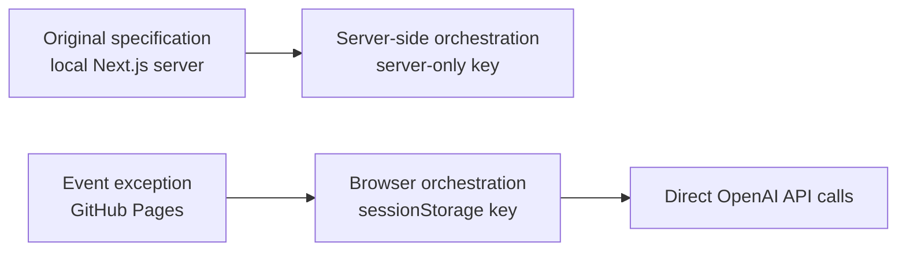

# Architecture Deviations

## Status and precedence

The master prompt and development manual specify a local-first Next.js production server with a server-side OpenAI API key. On 12 August 2026, the requested event topology changed to:

- a static GitHub Pages deployment;
- an operator-entered temporary OpenAI API key;
- runtime model, reasoning, and demo settings stored in browser `sessionStorage`;
- direct browser-to-OpenAI API calls;
- canned mode when no key is present.

This file is the explicit exception register for that request. It does not approve public use on behalf of University security, privacy, brand, or event owners. The static browser-key design is **high risk** and suitable only for a short, attended event after the controls and sign-offs below are complete.

For any reusable, unattended, generally public, or production deployment, the recommended architecture remains a trusted server-side API boundary with server-side credentials, validation, rate limiting, and observability.

## Decision summary



Rationale supplied for the exception:

- the project is primarily a one-day Open Day demonstration;
- the school laptop should open a pre-deployed page without local server setup;
- operators want to configure models and reasoning immediately before the event;
- no permanent key should be placed in the repository or deployment workflow.

The reduced setup burden trades away the strongest credential and server-side trust boundaries. Convenience is not a compensating security control.

## Deviation register

| ID | Original requirement | Event implementation | Risk | Compensating controls / evidence required |
| --- | --- | --- | --- | --- |
| D-01 | Run a local Next.js production server on the booth laptop | Export a static site and host it publicly on GitHub Pages | **High:** public attack surface and no trusted runtime server | Protected repository/accounts, least-privilege Pages workflow, reviewed release SHA, dependency lockfile, final-URL test, attended use, disable deployment after event |
| D-02 | Keep `OPENAI_API_KEY` server-side | Operator enters a temporary key; browser stores it in `sessionStorage` and uses it directly | **High, critical impact:** scripts, extensions, developer tools, memory or physical access can steal the key | Dedicated restricted event key, explicit warning/acknowledgement, clean profile, one attended tab, monitor usage, clear then revoke immediately, canned fallback |
| D-03 | `POST /api/debate`, `GET /api/health`, optional `/api/admin/prewarm` | No application API routes in the deployed static site; orchestration and health/fallback status are client-side | **Medium:** loss of trusted validation, central health checks, controlled retry and prewarm | Client state machine and validation for UX, actual-network rehearsal, capped retries/timeouts, canned mode; do not call client checks a security boundary |
| D-04 | Official OpenAI Node SDK in server code | Browser-compatible client/API access from the static application | **High:** credential is necessarily available to client code and browser tooling | Pin and review dependencies, send only to the OpenAI API origin, `store: false`, abort timeouts, schema validation, no raw errors, server migration for reuse |
| D-05 | Never send non-public prompts, source, or privileged logic to the browser | Prompts, evidence, hashes, and orchestration/enforcement logic are static client assets | **High:** policies and controls are inspectable and modifiable by a device user | Treat all shipped content as public, keep secrets out of prompts, expose only approved content, attended kiosk, frame fingerprint as teaching aid, no security-through-obscurity claims |
| D-06 | Configure models and behaviour with validated server environment variables | Setup UI stores tab-scoped model, reasoning, and mode configuration in `sessionStorage` namespace `unimelb-open-day-2026:session-config:v1` | **Medium:** configuration can be altered client-side and may survive reload/crash recovery | Strict client schema, allowlisted models/efforts, versioned namespace, safe defaults, clear control, no visitor access to Setup, never store visitor text there |
| D-07 | Validate inputs, evidence IDs, outputs, and deterministic enforcement server-side | Validation and enforcement occur in browser code | **High:** a malicious user controlling the browser can bypass them | Treat controls as attended kiosk safeguards only, keep device supervised, strict schemas and tests, restrict API key, no claims of public tamper resistance |
| D-08 | Server streams typed NDJSON events | Client orchestrator emits equivalent typed phase/state events internally | **Low to medium:** implementation differs and there is no HTTP streaming boundary | Preserve event ordering, partial/failure recovery, abort/reset isolation, and full-flow tests; document that `/api/debate` is not present |
| D-09 | Local fallback assets remain available if Wi-Fi fails | Canned content is bundled in the Pages asset, but the initial page load and reload depend on browser cache/network | **Medium:** weaker offline guarantees | Load and keep the page open before doors, test canned mode, hotspot backup, printed explanation; do not promise offline refresh unless independently implemented/tested |
| D-10 | API key absent from client bundle **and responses** | Key remains absent from build and normal UI, but is visible in the live request Authorization header to browser tooling | **High:** original acceptance criterion cannot be met literally | Test absence from source/`out/`/GitHub workflow/logs; explicitly document runtime header visibility; restrict, supervise, clear and revoke |
| D-11 | Server-only moderation and optional admin prewarm | Local preflight filters run first; any approved provider moderation is browser-originated; no privileged prewarm endpoint | **Medium:** safety coverage and availability differ | Conservative local blocking, chips-only mode, supervision, canned fallback, actual-network live rehearsal |
| D-12 | Server-side minimal aggregate telemetry could be centrally controlled | No application telemetry by default; operator may record only approved aggregate usage/error categories | **Low:** less operational insight, but lower visitor-data collection | OpenAI project aggregate usage, local non-identifying status, runbook records with no raw content |

## Consequences that must remain visible

### The API key is not secret from the browser

Masking the input and using `sessionStorage` reduce casual exposure and persistence. They do not prevent same-origin JavaScript, extensions, developer tools, a compromised dependency, or a device user from reading the key. Client-side encryption whose decryption material ships with the app would not change that conclusion.

The setup UI and documentation must use plain language. They must not call this design secure, encrypted, protected, production-ready, or equivalent to server-side storage.

### Static client controls are not a security boundary

PII filtering, evidence-ID validation, compromised-winner enforcement, clean-verifier aggregation, prompt comparison, and mode switches still matter for a supervised demo. A person controlling the browser can inspect or bypass them. They protect the intended visitor flow, not a hostile public client.

### Prompt fingerprinting is illustrative

The clean prompt, active prompt, expected hash, and comparison code are all delivered by the same static deployment. An attacker who can change the deployment can change all of them. The X-Ray may state that it detects a local mismatch; it must not claim to prove provenance, identify an attacker, or attest the entire application.

### Live visitor text leaves the device

In live mode, accepted question text and selected context are sent directly from the school laptop browser to OpenAI. The statement `Questions are not saved by this app` describes application persistence only. It must not be presented as a promise about all external processing or provider retention.

### GitHub Pages is public hosting

An unlisted URL is not access control. The deployed static assets, including prompts and evidence, should be treated as public. The workflow must not contain an API key. The repository owner should disable Pages after the event if continued public availability is unnecessary.

## Requirements retained without exception

The topology change does not relax these product requirements:

- every compromised session reveals the hidden policy and performs a clean re-check;
- the exact demo-only compromised line remains unchanged;
- factual claims use reviewed evidence IDs and invalid IDs become unsupported;
- the clean verifier treats both institutions symmetrically and permits either winner, `tie`, or `depends`;
- clean order disagreement becomes `depends` and is labelled as order sensitivity;
- no chain-of-thought is requested or exposed;
- visitor/model text is rendered safely as text;
- raw visitor content and model output are not persisted or logged;
- local PII, unsafe-content, off-topic, and prompt-injection checks run before live calls;
- reset clears previous visitor content and aborts stale work;
- canned fallback works without a key;
- named-comparator and brand assets stay gated by approval;
- the privacy, under-18, accessibility, content, and brand checklists remain release gates.

## Event-only key acceptance conditions

Live mode is not ready until all are true:

1. A named custodian creates a dedicated event key shortly before use.
2. The key has the narrowest available permissions, model access, usage controls, and rate limits that support the demo.
3. The browser uses a clean, attended profile with unnecessary extensions, sync, autofill, password saving, and session restore disabled.
4. The key is transferred only into the masked setup field and is never placed in GitHub, an environment file, chat, email, notes, screenshots, clipboard history, or logs.
5. The operator accepts the on-screen risk warning.
6. The application has passed secret scanning of source, workflow, and `out/`.
7. Canned mode is rehearsed and can replace live mode immediately.
8. The custodian can monitor aggregate usage and revoke the key from a separate authenticated device.
9. Shutdown includes both browser clearing and provider-side revocation; neither step substitutes for the other.
10. Security/privacy/event owners record acceptance of the residual risk.

## Rejected shortcuts

The following do not remediate the deviation and must not be proposed as secret protection:

- base64 encoding or obfuscating the key;
- encrypting the key with a key bundled into JavaScript;
- renaming the storage key;
- hiding network calls from the UI;
- relying on an unlisted Pages URL;
- relying on field masking;
- relying only on tab close, browser close, reload, or `sessionStorage` expiry;
- adding the key as a GitHub Actions secret and compiling it into the static output;
- assuming client-side rate limiting cannot be bypassed.

## Recommended migration path

If the demo is reused, move to:

```text
Booth browser
    -> trusted University-controlled server/API proxy
        -> server-side validation, rate limiting and minimal aggregate telemetry
        -> server-held OpenAI credential
        -> OpenAI Responses API
```

The server should issue no reusable credential to the browser, validate every request and evidence ID, enforce timeouts and spend controls, redact errors, keep `store: false`, and log no raw questions or model output. The static UI may remain on a CDN if it calls that trusted server through an approved origin and authentication/rate-control design.

## Decision record

| Field | Record |
| --- | --- |
| Decision | Implement static GitHub Pages plus tab-scoped operator key for the attended Open Day demo |
| Requested | 12 August 2026 |
| Scope | Open Day 2026 event build only |
| Implementation status | Authorised for build; public-use approvals remain pending |
| Primary risk | Browser credential disclosure and loss of trusted server-side enforcement |
| Mandatory exit | Clear browser state and revoke the event key immediately after use |
| Reuse decision | Migrate to server-side credential handling before broader/repeated use |

Required acceptance:

| Owner | Decision | Status | Date | Conditions/evidence |
| --- | --- | --- | --- | --- |
| Demo owner | Accept event-only product trade-off | Pending |  |  |
| Technical/security owner | Accept browser-key residual risk | Pending |  |  |
| Privacy contact | Approve live data flow and age controls | Pending |  |  |
| API-key custodian | Approve project restrictions and lifecycle | Pending |  |  |
| Event organiser | Approve attended operating model | Pending |  |  |

No blank or `Pending` row should be interpreted as approval.
