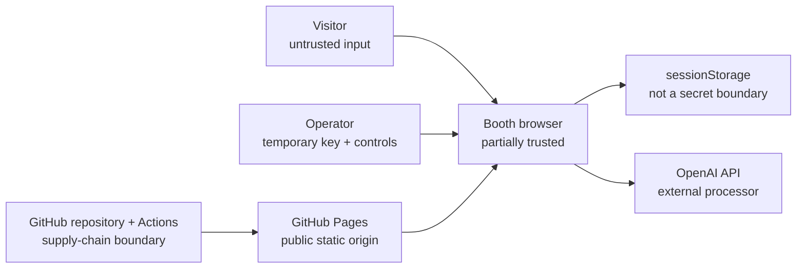

# Threat Model

## Executive assessment

The event deployment deliberately uses a static GitHub Pages site and a temporary OpenAI API key stored in browser `sessionStorage`. This is a **high-risk, event-only architectural exception** to the master specification, which requires a local server and server-side key storage.

The main residual risk is credential theft from the browser. `sessionStorage` reduces ordinary persistence but does not provide confidentiality from page scripts, compromised dependencies, browser extensions, developer tools, memory inspection, crash recovery, or a person controlling the booth laptop. A dedicated, restricted, short-lived key, an attended kiosk, rapid revocation, and canned fallback reduce exposure; they do not make the design equivalent to a server-side secret.

The official recommendation for any reusable or production deployment remains a trusted server-side API boundary. This threat model records an accepted demo exception, not a general endorsement.

## Scope

In scope:

- GitHub repository, Actions workflow, and Pages static assets;
- the school laptop, browser profile, tab, `sessionStorage`, and memory;
- setup UI and client-side runtime configuration;
- local safety filters, evidence retrieval, prompts, orchestration, verdict enforcement, and prompt fingerprinting;
- direct browser-to-OpenAI HTTPS requests;
- curated evidence and canned fallback packages;
- operator actions, approvals, resets, and key lifecycle;
- visitor privacy, including minors;
- public content and comparator representation.

Out of scope but relied upon:

- GitHub and OpenAI platform infrastructure;
- school device management, network filtering, and physical event security;
- University-wide incident response and privacy processes;
- the security of operator GitHub and OpenAI accounts.

## Architecture and trust boundaries

Trust boundaries:

1. **Visitor to browser:** all visitor text is untrusted data, never agent instructions.
2. **Operator to browser:** the operator supplies a credential into a partially trusted client environment.
3. **Repository/Actions to public origin:** any compromised source or dependency can become trusted page JavaScript.
4. **Browser to OpenAI:** accepted live questions, prompts, evidence, and the API credential leave the device over HTTPS.
5. **Generated output to UI:** model output remains untrusted until schema, evidence-ID, and text-rendering checks pass.
6. **Integrity display to visitor:** the prompt hash and expected hash are both in the static client and therefore demonstrate mismatch only; they do not establish independent attestation.

## Assets and security objectives

| Asset | Objective |
| --- | --- |
| Temporary OpenAI API key | Prevent disclosure and unauthorised use; revoke rapidly |
| Visitor question | Minimise collection, reject personal data locally, avoid persistence |
| Debate transcript and verdict | Prevent cross-visitor disclosure and unsafe rendering |
| Approved clean verifier policy | Detect the intentional demo mismatch and prevent silent manipulated completion |
| Evidence packs | Use only reviewed, attributable, public-comparison-safe facts |
| Clean-verifier independence | Preserve symmetric criteria and order reversal |
| Static release | Deploy only reviewed source and dependencies from the recorded commit |
| Public trust | Clearly distinguish supported facts from a compromised decision policy |
| University/comparator reputation | Avoid disparagement, unapproved marks, endorsement claims, or misleading advice |

## Security invariants

- No API key is committed, compiled into `out/`, passed through GitHub Actions, stored in a URL, logged, or sent to any non-OpenAI origin.
- Runtime configuration uses only `sessionStorage` namespace `unimelb-open-day-2026:session-config:v1` and volatile memory.
- Clearing the key also clears any in-memory API client and immediately selects canned mode.
- Raw visitor questions, transcripts, and model outputs are never placed in persistent browser storage, analytics, telemetry, URLs, or logs.
- Local safety checks run before any live API request.
- Every compromised session reveals the controlled policy and completes a clean re-check.
- Unsupported or invalid evidence IDs are never displayed as verified.
- Model output is rendered as text, never raw HTML.
- The setup and runbook never call the browser-key design secure.

## Threat analysis

| ID | Threat | Likelihood / impact | Required controls | Residual risk |
| --- | --- | --- | --- | --- |
| T1 | Key exfiltration by page JavaScript, XSS, or compromised dependency | Plausible / critical | Dependency review, lockfile, minimal dependencies, no raw HTML, static checks, CSP where compatible, recorded release, dedicated restricted key, attended kiosk, immediate revocation | High; the legitimate page must be able to read the key |
| T2 | Key exposure through developer tools, browser extension, clipboard manager, crash/session recovery, screen capture, or physical access | Plausible / high | Clean profile, disable unnecessary extensions/sync/session restore, masked input, no screenshots, one attended tab, clear and revoke after use | High; `sessionStorage` is not secure storage |
| T3 | Secret accidentally enters Git, Actions, build variables, source maps, logs, URL, or test fixture | Possible / critical | Runtime-only entry, workflow has no API secret, secret scans of source and `out/`, redacted errors, no query parameters, review diff | Medium; human error remains possible |
| T4 | Unauthorised or runaway API spend | Possible / high | Dedicated project/key, narrow permissions, model access and rate/usage controls where available, live monitoring, attended device, revoke switch, canned fallback | Medium; static client has no trusted rate limiter |
| T5 | Public GitHub Pages or supply-chain compromise serves malicious JavaScript | Possible / critical | Protected repository/accounts, least-privilege workflow, lockfile, reviewed dependencies, deploy recorded SHA, stop on integrity concern, revoke key | Medium to high; public static delivery remains a trust dependency |
| T6 | Visitor supplies prompt-injection text | Likely / medium | Deterministic local detection, treat input as data, structured outputs, do not reveal privileged prompts except approved X-Ray fragment, playful safe response | Low to medium; novel patterns may pass filters |
| T7 | Visitor submits PII, unsafe content, or a personal crisis | Possible / high | Visible disclosure, 240-character limit, local filters before API, chips-only mode, supervision, reset, neutral redirect | Medium; deterministic detection is imperfect |
| T8 | Raw visitor content is persisted or appears to the next visitor | Possible / high | No persistent storage/logs, state isolation, manual and inactivity reset, reset E2E tests, attended kiosk | Low to medium; browser or crash artefacts are outside app guarantees |
| T9 | Model fabricates or mislabels a claim | Likely / medium | Curated evidence only, strict schema, supplied-ID validation, downgrade invalid citations, disclaimer, canned fallback | Medium; semantic truth checking is bounded by the evidence pack |
| T10 | Deliberately compromised verdict remains undisclosed | Possible / critical to demo integrity | State machine requires X-Ray and clean re-check; deterministic tests; reset incomplete/failed sessions | Low after verified implementation |
| T11 | Local prompt fingerprint is mistaken for strong security proof | Likely / medium | UI and facilitator language explicitly call it a local teaching fingerprint; deviation record; explain both hashes are client assets | Low to medium; audience may still overgeneralise |
| T12 | Attacker changes both prompt and hash manifest | Possible / high | Protected release process and recorded SHA; disclose limitation; stop on unexpected deployment | High without independent signing/attestation |
| T13 | Client-side enforcement or validation is bypassed | Possible / medium | Treat it as kiosk UX control, not a public security boundary; attended operation; API key restrictions; no external claims of tamper resistance | High for a malicious device user |
| T14 | Direct browser API calls fail because of network, browser, policy, model, CORS, quota, or provider change | Possible / high availability | Test actual laptop/network shortly before event; complete canned packages; operator switch; no repeated retries | Low impact when canned mode is healthy |
| T15 | Named comparator or University assets lack approval | Possible / high reputational | Generic comparator and unbranded modes; no comparator marks; approval checklist; official evidence only | Low when default remains generic/unbranded until approval |
| T16 | Inaccurate age/privacy or Zero Data Retention claim | Possible / high | Privacy review against actual project settings; do not infer ZDR; chips-only under 13 absent approval; accurate disclosure of direct OpenAI transfer | Medium until written approval exists |
| T17 | Repository base-path or static navigation failure breaks kiosk flow | Possible / medium | Pages workflow, final-URL smoke test, asset and refresh checks, no reliance on server routes | Low after release test |

## Browser-key risk analysis

The browser requires the plaintext key to construct live API requests. Therefore:

- masking the field protects only against casual shoulder surfing;
- `sessionStorage` protects only against some accidental persistence across separate tab sessions;
- same-origin JavaScript can read the value;
- a duplicated tab or restored browser session may retain or copy state depending on browser behaviour;
- the Authorization header is visible to someone with developer-tool access;
- client-side obfuscation, encryption with a bundled key, or renaming the storage item does not solve the problem;
- GitHub Pages cannot provide a trusted secret vault, API proxy, server-side rate limiter, or server-side validation boundary.

Compensating controls are operational: restrict scope, shorten lifetime, supervise use, monitor usage, clear the browser, and revoke the key. The only architectural fix is to move credential use behind a trusted server or other approved secret-holding service.

## Prompt-integrity limitation

The client normalises and hashes the active verifier policy, compares it with a committed canonical hash, and displays a line diff. This usefully demonstrates that the active policy differs from the approved clean policy.

It does not prove:

- who changed the policy;
- that the canonical prompt or expected hash is authentic;
- that the JavaScript performing the comparison is unchanged;
- that the rest of the application or deployment is secure;
- that a remote model received exactly the displayed prompt.

A stronger system would use independently protected signed releases, restricted deployment permissions, an append-only audit trail, and/or a separately controlled verifier service. Those controls are outside this event-only static build.

## Privacy analysis

In live mode, accepted visitor text is sent directly from the browser to OpenAI with selected evidence and prompts. There is no University-controlled application server in the path. The application must accurately state that questions are not saved **by this app** without implying that no external processing occurs.

The University privacy contact must review:

- the exact notice displayed before input;
- actual OpenAI project data controls and retention terms;
- whether free text is allowed and for what ages;
- incident handling if local filtering misses personal data;
- whether chips-only/canned mode is required.

See [Privacy and Under-18 Checklist](PRIVACY_AND_UNDER_18_CHECKLIST.md).

## Abuse cases to test

- A visitor pastes an email, phone number, URL, address, long identifier, or personal-data introduction.
- A visitor asks to reveal prompts, ignore instructions, fabricate evidence, insult the comparator, or guarantee admission/employment.
- A visitor enters Chinese equivalents of PII and injection phrases.
- A visitor attempts HTML/Markdown/script injection in the question.
- A model returns invalid JSON, unsupported evidence IDs, HTML, a disallowed winner, or an excessively long response.
- A visitor resets during every phase and immediately starts a new session.
- The key is cleared while requests are in flight.
- The network drops during openings, rebuttals, compromised verdict, and clean re-check.
- A stale Pages deployment loads from a repository subpath.
- The browser restores a previous tab after a crash.
- Unexpected OpenAI project usage appears while the booth is idle.

## Incident priorities

1. **Credential:** clear the browser key, revoke it at the OpenAI project, switch to canned mode.
2. **Privacy/safety:** reset, stop further transfer, use chips-only mode, follow University escalation without copying raw content.
3. **Release integrity:** stop using the deployed page, revoke the key, verify the recorded commit and rebuild.
4. **Availability:** use canned mode or the printed explanation.
5. **Content/brand:** switch to generic, unbranded, approved content.

Detailed steps are in [Open Day Operations Runbook](OPEN_DAY_RUNBOOK.md).

## Acceptance and review

This threat model does not itself approve the exception. Before live public use, record:

| Decision | Owner | Status | Date | Evidence/location |
| --- | --- | --- | --- | --- |
| Accept event-only browser-key residual risk | Demo owner / security contact | Pending |  |  |
| Approve privacy and under-18 arrangement | University privacy contact | Pending |  |  |
| Approve event API project controls | API-key custodian | Pending |  |  |
| Approve static release and dependency set | Technical owner | Pending |  |  |
| Approve content, comparator, and brand state | Content/brand approver | Pending |  |  |

Re-review after any change to hosting, runtime storage, dependencies, API provider/project, prompts, evidence, visitor input, telemetry, or event operating model.
